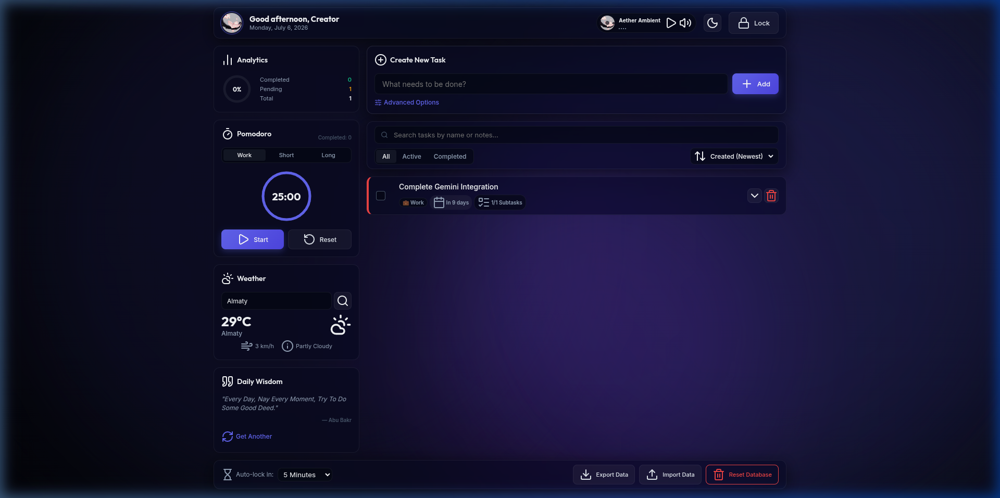
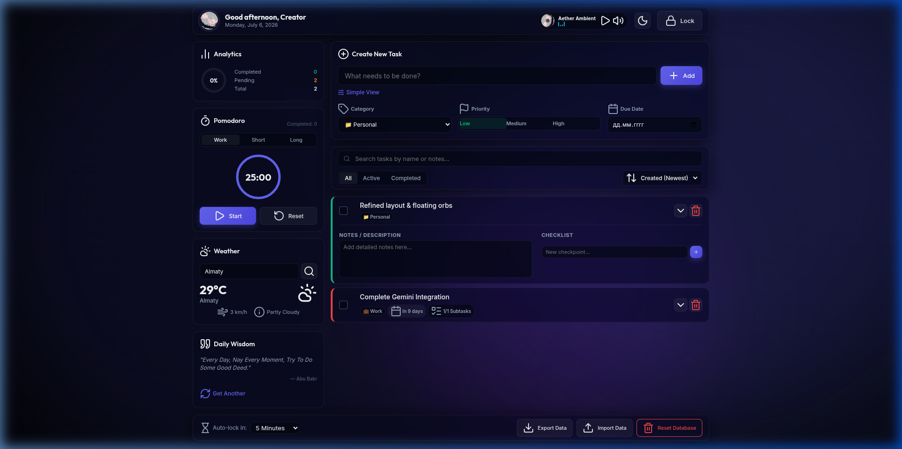

# AetherTodo — Безопасный локальный рабочий стол продуктивности

Современный, защищенный и функциональный To-Do интерфейс, в котором конфиденциальность стоит на первом месте. Созданный на чистом HTML5, CSS и JavaScript, **AetherTodo** шифрует ваши задачи, заметки и списки прямо в браузере с помощью встроенного Web Crypto API.

#### 🌐 Демонстрационная версия: [https://saikoful.github.io/todo/](https://saikoful.github.io/todo/)
#### Доступно на языках: [🇬🇧 English](README.md) | [🇺🇦 Ukrainian](README_UA.md)

---

## Ключевые возможности

### 🛡️ Безопасность с нулевым разглашением (Zero-Knowledge)
*   **Мастер-пароль**: Все записи блокируются при выходе. При первом запуске создается мастер-пароль.
*   **Шифрование AES-GCM 256-бит**: Данные задач, чек-листы, категории и настройки шифруются на лету.
*   **Деривация ключа PBKDF2**: Ключи шифрования вычисляются локально с использованием алгоритма PBKDF2 (100,000 итераций SHA-256) и случайной криптографической соли.
*   **Таймер автоблокировки**: Автоматически блокирует интерфейс и стирает расшифрованные данные в памяти при неактивности пользователя (настройки: 1м, 5м, 15м, 30m или никогда).
*   **Полная автономность**: Никаких серверов и облаков. Пароль и данные никогда не покидают ваше устройство.

### 🍅 Виджеты продуктивности
*   **Таймер Pomodoro**: Интегрированный таймер с круговой SVG-шкалой. Режимы: Работа (25 мин), Короткий отдых (5 мин) и Длинный отдых (15 мин). Статистика циклов сохраняется в зашифрованной базе.
*   **Панель аналитики**: Динамический подсчет выполненных, текущих и общих задач с радиальным кольцом прогресса.
*   **Виджет погоды**: Использует открытый API Open-Meteo (поиск по названию города + текущая погода). Если вы не в сети, автоматически симулирует реалистичные погодные условия по локальному времени.
*   **Цитата дня**: Выводит мотивирующие фразы через сторонний API с локальным списком разработческих афоризмов в качестве резервной копии.

### 🎵 Дизайн и аудио-интеграция
*   **Эстетичный аудиоплеер**: Воспроизводит фоновую музыку (`files/song.mp3`). Виниловая пластинка (с использованием `files/a.gif`) вращается в такт воспроизведению, а звуковые волны визуализируют проигрывание.
*   **Выдвижной регулятор громкости**: Ползунок громкости компактно спрятан и плавно выдвигается при наведении курсора на иконку звука.
*   **Синтез аудио-звонков**: С помощью технологии **Web Audio API** генерирует мягкие переливы при завершении задач и таймеров, не требуя загрузки тяжелых аудиофайлов.
*   **Стеклянный интерфейс (Glassmorphism)**: Стильный дизайн панелей с эффектом размытия заднего фона (backdrop blur), плавными микро-анимациями кнопок и дрейфующими цветными сферами на фоне.

### 📝 Продвинутое управление задачами (CRUD)
*   **Компактная форма ввода**: Детали задачи (дедлайн, приоритет, категория) скрыты под анимированной кнопкой «Advanced Options», оптимизируя рабочее пространство.
*   **Заметки и чек-листы**: Карточки раскрываются, позволяя писать длинные комментарии (автосохранение по расфокусировке) и отмечать чек-поинты.
*   **Умный поиск, фильтры и сортировка**: Мгновенный поиск по названиям и описаниям; разделение на все/активные/выполненные; сортировка по дате добавления, дедлайну или весу приоритета.
*   **Шифрованный экспорт/импорт**: Выгрузка всей базы в виде зашифрованного JSON-файла (для импорта потребуется ввести пароль) или в текстовом формате.

---

## Скриншоты

### 1. Рабочий стол
Оптимизированный стеклянный интерфейс с виджетами погоды, помодоро, плеером и статистикой.


### 2. Детализированный вид задачи
Дважды кликните по заголовку для редактирования, или раскройте карточку для добавления заметок и чек-листов.


---

## Технологический стек
*   **Разметка**: Семантический HTML5
*   **Стилизация**: CSS3 (CSS Variables, Glassmorphism, Backdrop Filters, Keyframe Animations)
*   **Логика**: ES6+ JavaScript
*   **Шифрование**: Web Crypto API (`crypto.subtle`)
*   **Иконки**: Lucide Icons CDN
*   **Шрифты**: Google Fonts (Outfit & Inter)

---

## Установка и запуск

1. Склонируйте репозиторий:
   ```bash
   git clone https://github.com/saikoful/todo.git
   cd todo
   ```
2. Запустите любой локальный статический сервер:
   ```bash
   # Через Python
   python3 -m http.server 8080
   
   # Через Node.js
   npx http-server -p 8080
   ```
3. Откройте `http://localhost:8080` в веб-браузере.

---

## Лицензия
Автор: [saikoful](https://github.com/saikoful). Проект распространяется по лицензии MIT.
